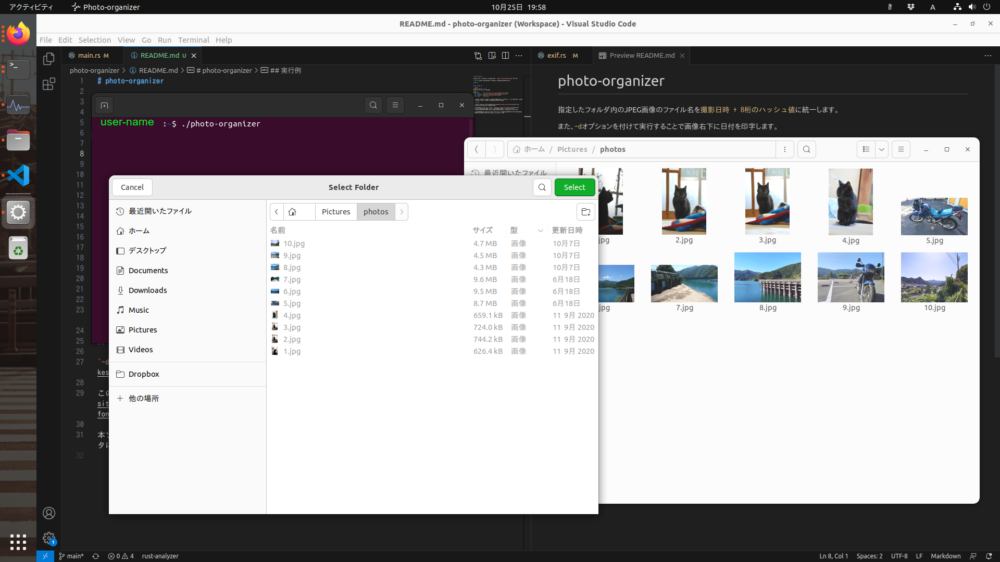
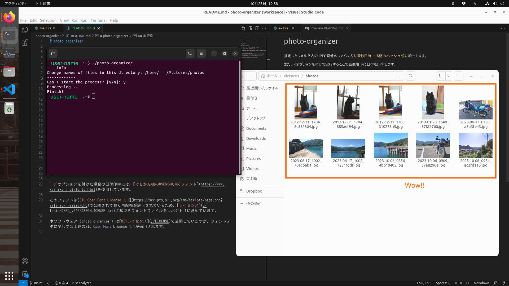
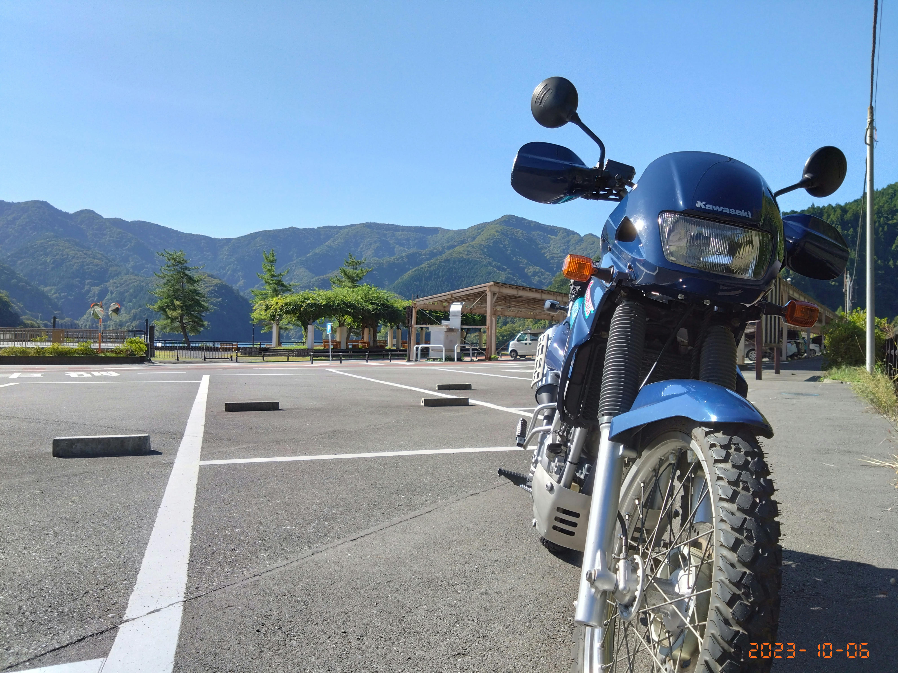

# photo-organizer

指定したフォルダ内のJPEG画像のファイル名を`撮影日時 + 8桁のハッシュ値`に統一します（ExifにDateTimeOriginalが記録されている画像に限る）。

また、`-d`オプションを付けて実行することで画像右下に日付を印字します。

## 実行オプション

```shell
$ photo-organizer --help
Usage: photo-organizer [OPTIONS]

Options:
  -d, --date       Print the date on the image (format: YYYY-MM-DD).
  -r, --recursion  Recursive processing when subdirectories exist.
  -k, --keep-exif  Keep Exif data when printing dates.
  -h, --help       Print help
```

`-d`オプションを付けた場合には画像処理の都合でExifデータが削除されるため、もしExifデータを維持したい場合は一緒に`-k`オプションを付けて実行してください。

## フォント

`-d`オプションを付けた場合の日付印字には、[けしかん様のDSEG(v0.46)フォント](https://www.keshikan.net/fonts.html)を使用しています。

このフォントは[SIL Open Font License 1.1](https://scripts.sil.org/cms/scripts/page.php?site_id=nrsi&id=OFL)で公開されており再配布が許可されているため、[ライセンス](./fonts-DSEG_v046/DSEG-LICENSE.txt)に基づきフォントファイルをレポジトリに含めています。

本ソフトウェア（photo-organizer）は[MITライセンス](./LICENSE)で公開していますが、フォントデータに関しては上述のSIL Open Font License 1.1が適用されます。

## 実行例

１．実行するとフォルダ選択ダイアログが開くので、処理したい画像が入っているフォルダを選択



２．処理を進めて良いか聞いてくるので、問題なければ`y`を入力。

３．終了！



`-d`オプションを付けた場合はこんな感じ↓


